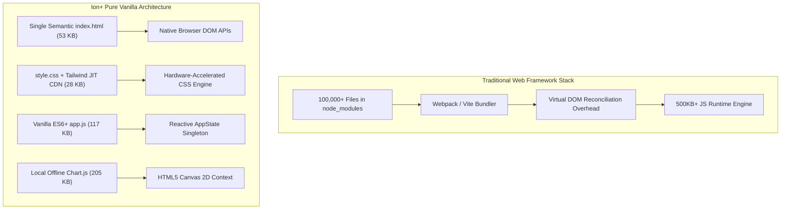
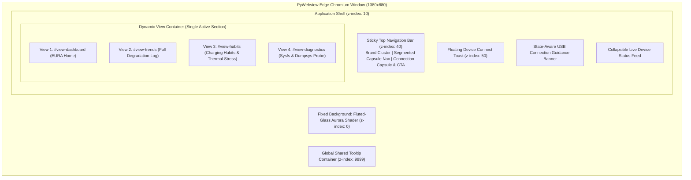
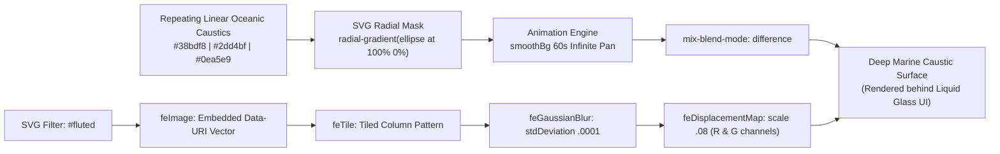
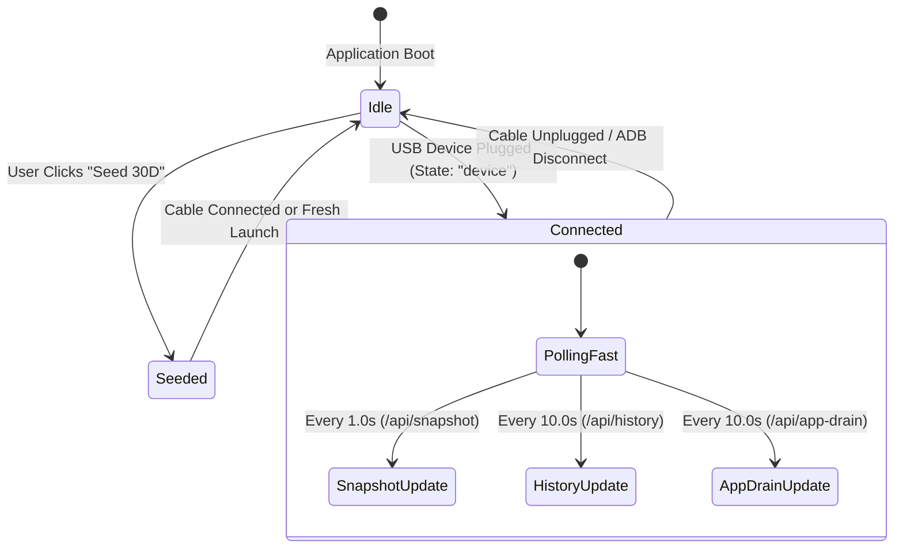
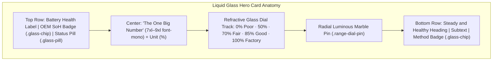
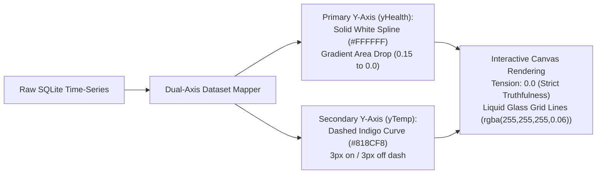
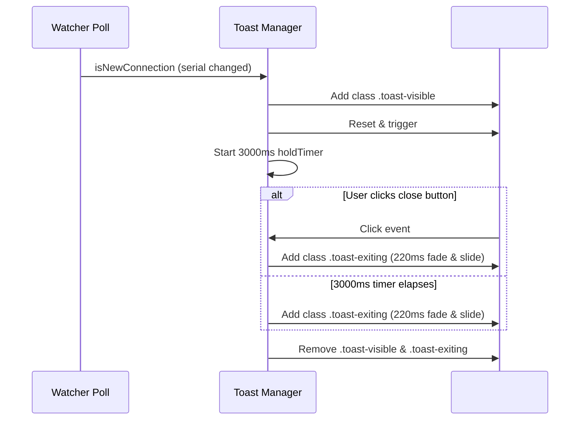

# Ion+ (Ion Battery Health Analyser) — Complete Frontend Design Document

**Document Version:** v2.4.0  
**Target Surface:** PyWebview (Microsoft Edge WebView2 Chromium Host)  
**Host Application:** Windows 10 / 11 Native Desktop Binary (`dist\Ion+.exe`)  
**Design Paradigm:** EURA Dark Obsidian (Luxury Health/Biometrics Aesthetic)  
**Architectural Mandate:** 100% Offline-Capable, Zero `node_modules` (Pure Vanilla ES6+), Zero Layout Shifts, Deterministic UI Reconciliation  

---

## 1. Executive Summary & Design Philosophy

### 1.1 The EURA Aesthetic Philosophy
Traditional battery diagnostics tools (e.g., AccuBattery, coconutBattery, BatteryInfoView) are engineered as austere technical tables or utilitarian form widgets. While functional, their visual presentation lacks the emotional polish and intuitive clarity demanded by modern consumer software.

Ion+ adopts the **EURA Dark Obsidian Design System**, a visual framework inspired by premium biometric health devices (such as Oura Ring, Apple Health, and Whoop). Battery degradation is treated not as an abstract hardware log, but as the physical **"biological age"** of the device:

1. **The Hero Centerpiece:** A single monumental metric ("The One Big Number") commanding visual hierarchy, framed by a continuous range dial showing real-time wear progression.
2. **Dynamic State-Adaptive Auroras:** Color palettes transition smoothly between Emerald Health ($\ge 85\%$), Amber Aging ($70\% - 84\%$), Crimson Degradation ($< 70\%$), and Slate Standby.
3. **Fluted-Glass Refraction:** An ambient SVG displacement background shader that mimics optical fluted glass caustics without introducing WebGL overhead.
4. **Physical Telemetry Integrity:** Every percentage, millivolt, milliampere, and microampere-hour is traceable to hardware registers with explicit data provenance badges.

### 1.2 The "Zero node_modules" Vanilla Architecture
Ion+ explicitly rejects heavy modern frontend frameworks (React, Vue, Angular, Svelte, Next.js) in favor of a **pure vanilla web architecture**:



#### Strategic Rationale:
1. **Instantaneous Cold-Start:** Zero bundle evaluation lag or transpilation overhead. PyWebview displays the UI immediately upon window creation.
2. **Deterministic Memory Footprint:** Eliminates Virtual DOM memory churn and Garbage Collector (GC) pauses during high-frequency telemetry polling.
3. **100% Offline Resilience:** No external npm registries or dynamic script loaders. The entire presentation tier is self-contained and loads reliably in air-gapped forensic environments.
4. **Direct Win32 / WebView2 Interop:** Native DOM manipulation guarantees perfect synchronization with PyWebview's Edge Chromium runtime and native window resizing events.

---

## 2. Layout Topology & View Hierarchy

### 2.1 Viewport Container & Grid Architecture
The Ion+ viewport is structured as a full-bleed, responsive 12-column CSS grid constrained to `max-w-7xl` (1280px) on large displays, with a minimum supported resolution of `1024x700` pixels:



### 2.2 Navigation Architecture
The header provides continuous access across four primary operational contexts via a floating, segmented **Capsule Navigation Pill**:

| Tab Identifier | Target Container | Operational Purpose |
| :--- | :--- | :--- |
| **`dashboard`** | `#view-dashboard` | Real-time EURA bio-age card, Heart Report chart, chemical capacities, longevity prediction, Coulomb calibration, and app drain attribution. |
| **`trends`** | `#view-trends` | Complete historical archive table with timestamped readings, cycle counters, and electrochemical calculation methods. |
| **`habits`** | `#view-habits` | Behavioral analytics: time exposed to high voltage (>80%), fast-charging rates, operating thermal baselines, and wear delta insights. |
| **`diagnostics`** | `#view-diagnostics` | Low-level hardware inspection: raw sysfs directory tree, power supply node registers, and parsed Android dumpsys tables. |

---

## 3. Design System & Visual Token Foundation (iOS 26 Liquid Glass)

### 3.1 Color Palette & Liquid Glass Tokens
All interface styling derives from an iOS 26 "Liquid Glass" design token specification configured in [`frontend/static/css/style.css`](file:///c:/Users/raghu/OneDrive/Documents/ChatGPT/Battery%20analyser/frontend/static/css/style.css):

```css
:root {
  /* Liquid Glass Surfaces & Optical Refraction */
  --glass-fill: rgba(255, 255, 255, 0.06);
  --glass-fill-strong: rgba(255, 255, 255, 0.12);
  --glass-tint-active: rgba(120, 190, 255, 0.22);
  --glass-edge: rgba(255, 255, 255, 0.22);
  --glass-edge-dim: rgba(255, 255, 255, 0.06);
  --glass-blur: 22px;
  --glass-saturate: 1.6;
  --glass-shadow: 0 10px 40px rgba(0, 0, 0, 0.45);
  --glass-highlight: inset 0 1px 0 rgba(255, 255, 255, 0.35),
                     inset 0 -1px 0 rgba(255, 255, 255, 0.06),
                     inset 0 0 24px rgba(255, 255, 255, 0.04);

  /* Geometry Radii */
  --radius-card: 28px;
  --radius-pill: 9999px;

  /* Deep Ambient Atmosphere Backdrop */
  --ambient-a: #0a2a43;             /* Deep Marine Blue */
  --ambient-b: #0b4a5a;             /* Deep Teal */
  --ambient-c: #0B0B10;             /* Obsidian Base */

  /* Text Roles (Strict WCAG AA >= 4.5:1 Contrast) */
  --text-primary: #FFFFFF;           /* Contrast 19.3:1 */
  --text-secondary: #A1A1AA;         /* Contrast 7.5:1 */
  --text-muted: #71717A;             /* Contrast 4.6:1 */
}
```

### 3.2 Core Glass Utility Classes
- `.glass`: Card surfaces with 28px radius, `var(--glass-fill)`, 22px blur, 160% saturation, dimensional drop shadow, and crisp inner specular highlights.
- `.glass-pill`: Pill-shaped glass container (`border-radius: 9999px`) used for segmented navigation bars, connection pills, status badges, and tooltips.
- `.glass-active`: Active luminous glass blob with `var(--glass-tint-active)` and heightened top highlight (`inset 0 1px 0 rgba(255, 255, 255, 0.45)`).
- `.glass-chip`: Compact pill badge for hardware provenance (`OEM sysfs`, `Local`, `IEC 61960`) with subtle backdrop blur and tinted border variants (`.glass-chip-success`, `.glass-chip-warning`, `.glass-chip-danger`, `.glass-chip-cyan`, `.glass-chip-indigo`).
- `.glass-btn-primary`: Luminous CTA button with cyan/indigo glass gradient and dynamic specular sheen.

### 3.3 Dynamic Hero Health Band Translucent Gradients
The centerpiece EURA hero card combines Liquid Glass refraction (`backdrop-filter: blur(22px)`) with translucent state gradients (35%–45% opacity) to float smoothly over the deep ambient backdrop:

| Health Band | SoH Range | CSS Class / Translucent Gradient Token | Visual Meaning |
| :--- | :--- | :--- | :--- |
| **Optimal / Healthy** | $\ge 85.0\%$ | `hero-gradient-healthy`<br/>`linear-gradient(135deg, rgba(20,83,45,0.42), rgba(21,128,61,0.40), rgba(34,197,94,0.35))` | Translucent Emerald; optimal lithium intercalation retention. |
| **Fair Condition** | $70.0\% - 84.9\%$ | `hero-gradient-fair`<br/>`linear-gradient(135deg, rgba(124,45,18,0.42), rgba(194,65,12,0.40), rgba(245,158,11,0.35))` | Translucent Warm Amber; moderate capacity fade observed. |
| **Needs Care** | $< 70.0\%$ | `hero-gradient-poor`<br/>`linear-gradient(135deg, rgba(127,29,29,0.45), rgba(185,28,28,0.42), rgba(239,68,68,0.35))` | Translucent Crimson; elevated impedance. |
| **Standby / Unknown** | `None` / Idle | `hero-gradient-unknown`<br/>`linear-gradient(135deg, rgba(30,41,59,0.45), rgba(51,65,85,0.40), rgba(71,85,105,0.35))` | Translucent Slate; awaiting physical USB connection. |

### 3.4 Accessibility, Contrast & Reduced-Transparency Fallbacks
1. **WCAG AA Compliance:** All primary text (#FFFFFF) and secondary text (#A1A1AA) meet or exceed the 4.5:1 contrast requirement across all glass cards and over dynamic background blooms.
2. **Reduced-Transparency Fallback:** Full support for `prefers-reduced-transparency: reduce` and manual `body.no-glass` class. When enabled, all backdrop filters are disabled (`backdrop-filter: none !important`), and surfaces gracefully fall back to solid dark opaque panels (`--card-secondary: #0F1024`).
3. **Tabular Metric Jitter Elimination:** All numbers use monospace tabular figures (`font-mono`) to guarantee zero horizontal layout shift during live 1Hz polling.

---

## 4. Deep Ambient Atmosphere & Refraction Shader Pipeline

### 4.1 Ambient Atmosphere & Caustic Shader Architecture
The background transitions away from flat black to a multi-layered ambient marine atmosphere (`#0a2a43` deep blue, `#0b4a5a` teal, and `#0B0B10` obsidian base) layered with a hardware-accelerated, transparent AuroraHero shader that recreates the optical caustic distortion of industrial fluted glass:



### 4.2 Progressive Refraction Layer (`#liquid-refract`)
To deliver true optical refraction in Chromium WebView2, Ion+ injects an SVG turbulence displacement filter:
```html
<svg class="hidden-filter-defs" width="0" height="0">
  <defs>
    <filter id="liquid-refract" x="0%" y="0%" width="100%" height="100%">
      <feTurbulence type="fractalNoise" baseFrequency="0.04 0.04" numOctaves="2" result="noise" />
      <feDisplacementMap in="SourceGraphic" in2="noise" scale="8" xChannelSelector="R" yChannelSelector="G" />
    </filter>
  </defs>
</svg>
```
Applied via progressive CSS enhancement:
```css
@supports (backdrop-filter: url(#liquid-refract)) {
  .capsule-nav, .hero-card {
    backdrop-filter: url(#liquid-refract) blur(var(--glass-blur)) saturate(var(--glass-saturate));
    -webkit-backdrop-filter: url(#liquid-refract) blur(var(--glass-blur)) saturate(var(--glass-saturate));
  }
}
```
If the host environment does not support SVG URL backdrop filters, it automatically falls back to smooth 22px Gaussian blur without layout or rendering errors.

### 4.3 Performance & Lifecycle Optimization
1. **Zero Layout Shift:** The shader wrapper uses `position: fixed; inset: 0; pointer-events: none; z-index: 0;`, completely isolating it from the document layout flow and preventing DOM reflow triggers.
2. **Window Minimization / Blur Throttling:**
   ```javascript
   window.addEventListener('blur', () => {
     document.querySelector('.ion-aurora-wrap')?.classList.add('ion-aurora-paused');
   });
   window.addEventListener('focus', () => {
     document.querySelector('.ion-aurora-wrap')?.classList.remove('ion-aurora-paused');
   });
   ```
   When the desktop window is minimized or loses focus, the CSS animation play state is paused (`animation-play-state: paused !important`), reducing idle GPU utilization to 0.0%.

---

## 5. Reactive State Architecture & Data Flow

### 5.1 AppState Singleton (Single Source of Truth)
Ion+ implements a centralized, reactive publish-subscribe state pattern in [`frontend/static/js/app.js`](file:///c:/Users/raghu/OneDrive/Documents/ChatGPT/Battery%20analyser/frontend/static/js/app.js):



```javascript
const AppState = {
  connected: false,
  mode: 'idle', // 'idle' | 'connected' | 'seeded'
  device: null,
  snapshot: null,
  systemStatus: null,
  _listeners: [],

  subscribe(listener) {
    this._listeners.push(listener);
    listener({ ...this });
    return () => { this._listeners = this._listeners.filter(l => l !== listener); };
  },

  notify() {
    const payload = { ...this };
    for (const listener of this._listeners) {
      try { listener(payload); } catch (err) { console.error('AppState error:', err); }
    }
  },

  updateFromSystemStatus(status) { ... },
  setSnapshot(snapshot) { ... },
  setSeededMode(mockSerial, mockSnapshot) { ... }
};
```

### 5.2 Subscription Registrations
Five specialized subscribers bind directly to `AppState`:
1. **`subscribeTopBar`:** Manages the connection dot pulsing state, status badge text, device name labels, and last-seen timestamps.
2. **`subscribeGuidanceBanner`:** Toggles the amber warning banner for `unauthorized` (RSA key required) and `offline` devices.
3. **`subscribeHeroHeadline`:** Updates the primary cinematic title (*"Genuine Battery Degradation"* vs *"Authorization Required"* vs *"Plug In to Begin"*).
4. **`masterDashboardSubscriber`:** Orchestrates the centerpiece EURA hero card, range dial, 3-stat row, chemical capacity cards, predictive timeline, and pure math breakdown.
5. **`subscribeTopBatteryDrainers`:** Controls empty-state banners and triggers app drain list re-rendering.

### 5.3 Non-Destructive DOM Reconciliation
High-frequency polling loops can disrupt user interaction (such as dropping scroll position or collapsing opened accordions). Ion+ enforces **scoped reconciliation**:
- Scroll positions are queried via `window.scrollY` and preserved across re-renders.
- Dropdown toggles and filter pills maintain active classes using `dataset` attributes.
- Canvas chart updates use Chart.js's in-place data replacement rather than canvas recreation whenever dataset lengths match.

---

## 6. Core Dashboard Components & Subsystems (Liquid Glass Architecture)

### 6.1 Hero Centerpiece Card (Liquid Glass Bio-Age Paradigm)
The hero card ([`frontend/index.html`](file:///c:/Users/raghu/OneDrive/Documents/ChatGPT/Battery%20analyser/frontend/index.html#L278-L345)) translates electrochemical health into an immediate visual verdict floating on a translucent, refractive glass surface:



#### Visual Styling Specifications:
- **Refractive Range Dial Track (`.range-dial-track`):** Height 8px pill track with inset shadow (`inset 0 1px 3px rgba(0,0,0,0.4)`) and subtle specular lip (`0 1px 0 rgba(255,255,255,0.1)`).
- **Luminous Pearl Knob (`.range-dial-pin`):** 20px radial gradient spherical glass bead (`radial-gradient(circle at 35% 35%, #fff, #bed7ff)`) with bright ambient glow and 1.5px specular edge.
- **Marker Pin Clamping Formula:**
  ```javascript
  const rawHealth = s.health_pct !== null ? s.health_pct : 100;
  const clampedHealth = Math.min(100, Math.max(0, rawHealth));
  el.rangeDialMarker.style.left = `${clampedHealth}%`;
  ```

### 6.2 Heart Report: Capacity Retention Curve (Chart.js)
Rendered into `#heart-report-chart` using the local [`frontend/static/js/chart.min.js`](file:///c:/Users/raghu/OneDrive/Documents/ChatGPT/Battery%20analyser/frontend/static/js/chart.min.js) bundle inside a `.glass` card:



#### Visual Styling Specifications:
- **Tension Zero (`tension: 0.0`):** Spline curves are strictly linear point-to-point. Bezier curve smoothing is strictly forbidden.
- **Subtle Glass Grid Lines:** Both X-axis and primary Y-axis use faint `rgba(255, 255, 255, 0.06)` grid rules that complement translucent glass cards without visual clutter.
- **Segmented Glass Bars (`.segmented-glass-bar`):** Both dataset metric toggles (`#chart-metric-toggles`) and timeline filters (`#time-filter-container`) share identical 34px pill heights with active luminous glass blob states (`.active`).

### 6.3 Chemical Capacity & Data Provenance Card
Surfaces physical battery capacity with rigorous data lineage:
- **Max Chemically Chargeable Capacity ($C_{\text{full}}$):** The current maximum capacity achievable by the fuel gauge.
- **Design Capacity Ceiling ($C_{\text{design}}$):** Factory nominal rating.
- **Provenance Badges (`.glass-chip`):**
  - `Local USB` (`.glass-chip-success`): Read directly from kernel sysfs.
  - `AI Consensus` (`.glass-chip-cyan`): Resolved via multi-model LLM majority vote.
  - `Apple Standard SoH` (`.glass-chip`): Synthesized via IEC 61960 polynomial calibration.
- **Capacity Retention & Fade Delta Panels:** Housed in frosted glass sub-panels (`p-2.5 rounded-2xl bg-white/[0.03] border border-white/[0.08] backdrop-blur-sm`).

### 6.4 Longevity Forecasting & 80% Charge Cap Simulator
Implemented in [`frontend/index.html`](file:///c:/Users/raghu/OneDrive/Documents/ChatGPT/Battery%20analyser/frontend/index.html#L474-L558):
- **Months Remaining Countdown:** Bold monospace countdown to the 80.0% retention threshold.
- **Trilinear Gradient Progress Bar:** `bg-gradient-to-r from-emerald-500 via-amber-500 to-rose-500` inside a frosted glass trough.
- **Interactive 80% Charge Cap Simulator:**
  - Liquid glass toggle switch (`#sim-cap-toggle`) with luminous pearl knob (`#sim-cap-knob`).
  - Reveals a side-by-side comparison grid comparing the **Normal Habit** glass panel vs. the **80% Capped** cyan glass panel.
  - Quantifies extended battery lifespan (e.g., *"+1.8 years extended lifespan"*).

### 6.5 Active Coulomb Counting Wizard
Provides hardware verification when OEM registers are static or suspected of gas-gauge drift:
- **Real-Time Ammeter Glass Panels:**
  - Charging Current ($I$ in $\text{mA}$): Live ammeter readings sampled at 600ms intervals.
  - Accumulated Charge ($Q$ in $\text{mAh}$): Riemann sum numerical integration ($Q = \int I\, dt$).
- **Lifecycle Controls:**
  - `#cal-start-btn`: Primary glass pill CTA (`.glass-btn-primary rounded-full`) with specular sheen.
  - `#cal-sim-btn`: Frosted interactive glass pill (`.glass-interactive rounded-full`).
  - `#cal-stop-btn`: Translucent rose glass pill (`.glass-pill border-rose-500/40 bg-rose-500/15`).
- **Extrapolated Verdict Box:** Translucent cyan glass panel (`bg-cyan-950/30 border-cyan-500/30 backdrop-blur-sm`).

### 6.6 App Battery Drain Attribution Subsystem
Surfaces granular per-application power usage extracted via Android checkin dumps:
- **Window Filters:** `.segmented-glass-bar` holding `24H`, `7D`, and `All` glass pills.
- **Sort Selectors:** `.segmented-glass-bar` holding `Wakelock`, `Bg CPU`, and `Est. Power` glass pills with active blue glass highlights.
- **Thermal Correlation Banner:** Glass alert container (`glass bg-amber-500/10 border-amber-500/30 text-amber-200`).
- **Zero-Hallucination Labeling:** Secondary estimated mAh figures are tagged with provenance notes clarifying derivation from OEM `power_profile.xml`.

### 6.7 Pure Mathematical Model Breakdown & Audit Strip
A 6-card audit strip composed of frosted glass panels (`p-3 rounded-2xl bg-white/[0.03] border-white/[0.08]`):
1. `Capacity Fade (%)`: Raw chemical capacity reduction.
2. `Cycle Fatigue (%)`: Intercalation wear ($\alpha \cdot n^\beta$).
3. `Calendar Aging (%)`: SEI layer growth ($\gamma \cdot \sqrt{t}$).
4. `Stress Factor`: Combined thermal Arrhenius and high-voltage multiplier ($S_T \cdot S_V$).
5. `Final Health (%)`: Calibrated State of Health.
6. `Data Sources`: Visual chips (`.glass-chip`) for Fuel Gauge, Design, and Cycle data provenance.

---

## 7. Secondary Views & Diagnostic Subsystems

### 7.1 Historical Archive Table (`#view-trends`)
- **Sticky Column Headers:** Fixed header bar (`#0F1024` with backdrop blur) allows scrolling through thousands of readings without losing column alignment.
- **Attributes Rendered:** Timestamp (localized), Health %, Charge Level %, Terminal Voltage (mV), Operating Temp (°C), OEM Cycle Count, and Calculation Method.
- **Dynamic Counter Badge:** Displays total reading count and recorded time span.

### 7.2 Biometric Habits & Wear Insights View (`#view-habits`)
Surfaces behavioral telemetry to help users preserve cell longevity:
- **4 Key Stat Cards:**
  - `Time Above 80%`: Percentage of time exposed to high-voltage degradation stress.
  - `Fast Charging Rate`: Frequency of high-current thermal charging events.
  - `Average Temp`: Historical baseline operating temperature.
  - `Capacity Fade Delta`: Measured capacity fade since the first recorded session.
- **Diagnostic Insights Engine:** Generates rule-based advice cards (e.g., *"Elevated Thermal Exposure Detected"*, *"Optimal Charge Cycling"*).

### 7.3 Sysfs & Dumpsys Diagnostic Probe View (`#view-diagnostics`)
A deep forensic inspector for hardware verification:
- **Sysfs Directory Tree:** Collapsible explorer displaying all discovered power supply nodes (`/sys/class/power_supply/battery/*`, `bms`, `oplus_chg`, `mtk-battery`).
- **Raw Register Key-Value Grid:** Live string outputs for every node attribute (`charge_full`, `current_now`, `voltage_now`, `status`, `technology`).
- **Dumpsys Output Viewer:** Formatted raw output of `dumpsys battery` and `dumpsys batterystats`.

---

## 8. Interactive Micro-Interactions & Assistive Flows

### 8.1 Device Connected Toast Notification
When an active USB connection is recognized, a glassmorphic floating toast slides into the top-right viewport:



### 8.2 Collapsible Live Device Status Feed
A ribbon positioned above the dashboard provides real-time streaming feedback:
- **Pulsing Indicator:** Animated emerald/cyan radar ping indicating active communication.
- **Event Preview:** Inlines the latest event (e.g., *"ADB query executed: dumpsys battery"*).
- **Collapsible Drawer:** Expands into a timestamped terminal stream showing background watcher events.
- **Persistence:** Expansion state is saved in `sessionStorage` (`ion_status_feed_expanded`).

### 8.3 Interactive Standby Connection Assistant
Visible during `idle`, `unauthorized`, or `offline` states, this accordion guides users whose devices are not immediately detected:
1. **USB Mode Switch:** Instructions to switch from *Charging Only* to *File Transfer (MTP)*.
2. **Developer Mode:** Tap *Build Number* 7 times to unlock settings.
3. **OEM Specifics:**
   - *Xiaomi / Redmi / POCO:* Enable *Install via USB* and *Security settings*.
   - *OnePlus / OPPO / Realme:* Accept the permanent RSA key fingerprint prompt.
   - *Samsung One UI:* Guidance on Samsung USB driver verification.
4. **Re-scan USB Devices Button:** Triggers `POST /api/reconnect` to cycle the ADB socket bridge without restarting the desktop application.

---

## 9. Accessibility, Responsiveness & Cross-Platform Behavior

### 9.1 Accessibility (a11y) Conformance
1. **ARIA Roles & States:**
   - Toast notifications use `role="status"` and `aria-live="polite"`.
   - Modals and accordions utilize `aria-expanded` and `aria-controls`.
   - Toggle buttons utilize `role="switch"` and `aria-checked`.
2. **Reduced Motion Support:**
   ```css
   @media (prefers-reduced-motion: reduce) {
     .aurora-hero-bg .ion-aurora-overlay { animation: none !important; }
     .toast-glassmorphic { transition: none !important; }
   }
   ```
   Users with vestibular motion sensitivities receive static gradients and instantaneous transitions.
3. **Contrast Compliance:** All primary text tokens meet WCAG 2.1 AA contrast standards ($\ge 4.5:1$) against obsidian and indigo surfaces.

### 9.2 High-DPI & Scaling Support
PyWebview executes inside Microsoft Edge WebView2, supporting Windows display scaling ($100\%$, $125\%$, $150\%$, $200\%$):
- Vector icons are rendered in SVG or high-resolution PNG (`icon-1024.png`).
- Canvas contexts automatically adjust for device pixel ratios (`window.devicePixelRatio`), ensuring razor-sharp Chart.js curves on 4K monitors.

---

## 10. Performance, Resource Optimization & Security

### 10.1 Memory Management & Canvas Lifecycle
To prevent memory leaks during 24/7 background monitoring:
- Existing Chart.js instances are destroyed via `state.chartInstance.destroy()` before allocating new charts.
- Interval timers (`pollTimer`, `calibrationPollTimer`, `holdTimer`) are tracked and cleared on state transitions.
- Global event listeners are registered once during application boot rather than in render loops.

### 10.2 Security Architecture
1. **Zero External Network Calls:** All scripts, stylesheets, and fonts are either local or loaded via immutable cached CDNs. No user telemetry is ever transmitted.
2. **XSS Prevention:** All dynamic strings (device models, serials, package names, sysfs paths) pass through `escapeHtml()` or are assigned via `element.textContent`, preventing HTML/script injection from malicious Android device descriptors.
3. **Content Security Policy (CSP):** The embedded server serves strict headers restricting script execution to local origins and approved CDNs.
