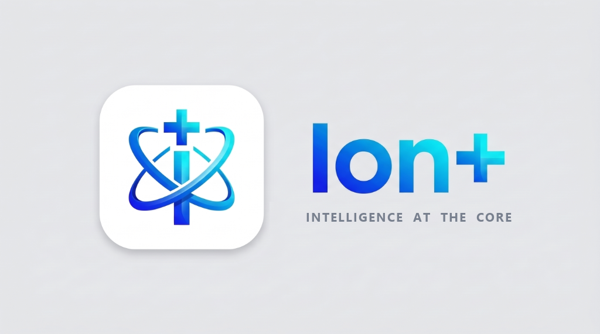

# Ion+ — Battery Health & Longevity Analyzer

<p align="center">
  
</p>

<p align="center">
  <b>INTELLIGENCE AT THE CORE</b> — Direct ADB-Powered Battery Degradation, Electrochemical Longevity & Deep Hardware Diagnostics for Android
</p>

<p align="center">
  
  
  
  
  
</p>

---

## Overview

**Ion+** is an ADB-powered desktop diagnostics application that connects to any Android phone via USB-C to calculate and visualize true electrochemical battery health and degradation trends. It bypasses OEM ambiguity and the vague *"Battery health: Good"* placeholder by probing real kernel hardware counters (`charge_full`, `charge_full_design`, `cycle_count`, temperature, voltage) across sysfs and dumpsys.

---

## Key Features

- **Direct Hardware Probing (No Root Required)**:
  - Communicates via Android Debug Bridge (`adb shell dumpsys battery` and `/sys/class/power_supply/battery/...`).
  - Probes design capacity, current full capacity, voltage, temperature, cycle counts, and charging status.
  - Automatically identifies accessible kernel sysfs paths across OEM firmware lineages (Samsung One UI, Pixel, ColorOS, Realme UI, OxygenOS, Nothing OS, Xiaomi MIUI/HyperOS).
- **Dual-Engine Health Calculation**:
  - **Primary Method (`capacity_ratio`)**:
    $$\text{Battery Health (\%)} = \left( \frac{\text{charge\_full\_uah}}{\text{charge\_full\_design\_uah}} \right) \times 100$$
  - **Fallback Method (`trend_estimate`)**:
    Used when OEM firmware hides `charge_full_design`. Compares observed capacity against the initial logged baseline.
- **Charging Habit & Wear Analytics**:
  - Time spent in high state-of-charge (> 80%).
  - Fast-charging frequency (high voltage > 4200 mV).
  - Operational temperature history and thermal stress warnings (> 42°C).
- **EURA iOS Health/Wellness Desktop UI**:
  - Centerpiece hero card with giant bold health % typography (EURA "24 years" bio-age aesthetic).
  - Meaning-driven dynamic gradients: Emerald (≥ 85%, `#14532D` → `#22C55E`), Amber (70–84%, `#7C2D12` → `#F59E0B`), and Crimson (< 70%, `#7F1D1D` → `#EF4444`).
  - Integrated horizontal range dial (0–100) with a live position pin and comparative status diagnosis line.
  - Black "Heart Report" trend card with a white line chart and a 3-stat summary row underneath (Temperature, Voltage, Cycle Count).
  - Deep indigo-to-violet-to-black cinematic diagonal background (`#0A0E27` → `#1B1035` → `#000000`) with ambient glow.
  - Floating pill-capsule navigation (`Dashboard`, `History`, `Insights`, `Diagnostics`) and pill connection button.
- **Background Watcher**:
  - APScheduler polling loop automatically detects phone connection events and records readings without manual intervention.
- **100% Local & Private**:
  - No cloud connections, no telemetry, zero data leaving your computer.
  - Self-contained SQLite database (`battery_data.db`).
  - Bundled local Chart.js library for complete offline operation.

---

## Project Structure

```
Ion-Battery-Health-Analyser/
├── backend/
│   ├── adb_client.py        # ADB connection & hardware sysfs/dumpsys probe
│   ├── calibration.py       # Voltage-drop load step & baseline calibration
│   ├── db.py                # SQLite schema & historical aggregation queries
│   ├── device_profiler.py   # Multi-vendor sysfs kernel deep discovery
│   ├── health.py            # Primary & fallback health calculation engines
│   ├── prediction.py        # Degradation curve modeling & cycle extrapolation
│   ├── watcher.py           # Background connection watcher (APScheduler)
│   ├── api_routes.py        # FastAPI REST endpoints
│   └── main.py              # Application entrypoint & static file serving
├── frontend/
│   ├── index.html           # Desktop dashboard shell
│   ├── history.html         # History view redirect
│   └── static/
│       ├── css/style.css    # Dark glassmorphism, glows & animations
│       ├── js/app.js        # State, live polling, & Chart.js logic
│       ├── js/chart.min.js  # Offline-ready Chart.js bundle
│       └── assets/          # Brand logos, dark/light banners, and favicon
├── tests/
│   ├── test_health.py          # Health calculation tests
│   ├── test_db.py              # Database CRUD & aggregation tests
│   ├── test_parser.py          # Dumpsys & sysfs parsing tests
│   ├── test_api.py             # FastAPI endpoint integration tests
│   ├── test_deep_scan.py       # Multi-vendor deep scan & cycle tests
│   ├── test_calibration.py     # Calibration engine tests
│   ├── test_virtual_phones.py  # Hardware simulation & edge-case suite
│   ├── test_prd_metrics.py     # PRD stability & metrics tests
│   └── test_device_profiler.py # Device profiler & consensus tests
├── desktop.py               # Native desktop window launcher (PyWebview)
├── splash.py                # Frameless Adobe-style glassmorphic splash screen
├── Ion+.vbs                 # Silent background Windows launcher
├── run.bat                  # One-click Windows runner
├── build_exe.bat            # PyInstaller one-click compilation script
├── requirements.txt         # Project dependencies
└── README.md
```

---

## Phone Setup (One-Time)

To allow Ion+ to communicate with your Android phone:

1. **Enable Developer Options**:
   - Open **Settings** → **About Phone**.
   - Tap **Build Number** 7 times until you see *"You are now a developer!"*.
2. **Enable USB Debugging**:
   - Open **Settings** → **System** → **Developer Options**.
   - Toggle **USB Debugging** to **ON**.
3. **Connect to Laptop**:
   - Plug the phone into your computer via a USB-C cable.
   - When the notification appears on the phone, select **File Transfer / Android Auto** (do not leave it on *"Charging only"*).
4. **Authorize Computer**:
   - On the phone screen, accept the prompt: *"Allow USB debugging from this computer?"*.
   - Check **"Always allow from this computer"** and tap **Allow**.

---

## Running the Application

### Option 1: Standalone `.exe` (Recommended - Native Desktop App)
Double-click **`dist\Ion+.exe`** or the **Ion+** shortcut on your Windows Desktop.
- **Adobe-Style Startup Screen**: Frameless dark glassmorphic splash card with app logo, glowing progress bar, and real-time initialization ticker.
- **Zero Command Prompt Window**: Launches directly into the desktop window.
- **Self-Contained**: Can be copied anywhere or pinned to your Windows Taskbar/Start Menu.

### Option 2: Windows Desktop Shortcut
Double-click the **Ion+** shortcut on your Desktop or in the project folder.
*(If you ever move the project folder, run `create_shortcuts.bat` to refresh the shortcuts).*

### Option 3: Quick Launch (`run.bat`)
Double-click `run.bat`. It launches the compiled `.exe` (or `pythonw.exe`) and closes the console immediately.

### Option 4: Developer / Debug Mode (`run_debug.bat`)
If you want to view live backend terminal logs and debug messages:
```cmd
run_debug.bat
```

### Option 5: Rebuilding the Executable (`build_exe.bat`)
To recompile the standalone `.exe` after making any code or styling changes:
```cmd
build_exe.bat
```
Output executable will be generated at: `dist\Ion+.exe`.

---

## Diagnostic Hardware Probe CLI

To run a quick hardware probe from your command line and inspect what sysfs fields your connected device exposes:
```powershell
.\.venv\Scripts\python.exe -m backend.adb_client
```

---

## Running Automated Tests

```powershell
.\.venv\Scripts\python.exe -m pytest tests/ -v
```
